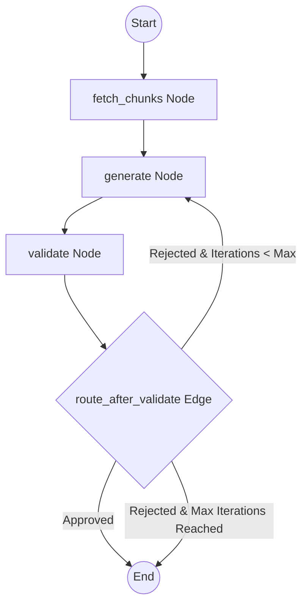

# Team B — Classroom Exam Creator Agent

This repository contains **Team B's Exam Creator Agent** system. It uses **LangGraph** to coordinate a structured, self-correcting agentic pipeline that fetches note chunks, drafts exam questions, validates them, and automatically self-corrects any invalid questions.

---

## Workflow Diagram

The pipeline structure is visualized below. You can also view the high-resolution image at [exam generator and validator flow.png](file:///c:/Users/mazen/Desktop/Leo-Agent/Leo-Agent/exam%20generator%20and%20validator%20flow.png).



---

## Project Structure

```
Leo-Agent/
│
├── .env                        # Local API configuration
├── .env.example                # Configuration template
├── requirements.txt            # Python dependencies
├── README.md                   # Project overview & running instructions
├── main.py                     # Main CLI entry point
├── exam generator and validator flow.png  # Rendered LangGraph visualization
│
├── config/
│   └── settings.py             # Config loader (Lightning AI base URL, model configuration)
│
├── agents/
│   ├── __init__.py
│   ├── generator_agent.py      # Generator Agent (drafts exam questions)
│   └── validator_agent.py      # Validator Agent (grounds questions against notes)
│
├── graph/
│   ├── __init__.py
│   ├── exam_graph.py           # LangGraph state machine graph compilation
│   ├── nodes.py                # Graph nodes (fetch, generate, validate)
│   ├── edges.py                # Conditional routing logic
│   └── state.py                # Shared ExamState TypedDict definition
│
├── schemas/
│   ├── __init__.py
│   ├── note_chunk.py           # Shared NoteChunk structure
│   └── exam_object.py          # Shared ExamObject & Question structures
│
└── tests/
    └── team_b/
        ├── conftest.py         # Mock data fixtures
        ├── test_exam_graph.py  # Graph execution & iteration tests
        ├── test_generator_agent.py
        ├── test_validator_agent.py
        └── mock_data/
            └── mock_mcp_response.json  # Mock database chunks about AI & Python
```

---

## Setup Instructions

### 1. Prerequisites
- **Lightning AI API Access**: Make sure you have a Lightning AI account and API key.

### 2. Configure Environment
1. Initialize the environment file:
   ```bash
   cp .env.example .env
   ```
2. Adjust variables in `.env` if necessary:
   ```env
   MODEL_NAME=lightning-ai/deepseek-v4-pro
   LIGHTNING_API_KEY=your_lightning_api_key_here
   LIGHTNING_BASE_URL=https://lightning.ai/api/v1/
   MAX_VALIDATION_ITERATIONS=3
   ```

### 3. Install Dependencies
Using **uv**:
```bash
uv sync
```
*(Alternatively, using pip: `pip install -r requirements.txt`)*

---

## Running the Application

### 1. Run the Exam Creator Pipeline
Execute the main entry point by specifying a session ID and target topics:
```bash
uv run python main.py --session test-session-001 --topics ai,python
```

### 2. Run Unit Tests
To execute Team B's test suite:
```bash
uv run pytest
```

---

## Core Components & Self-Correction

* **Generator Agent**: Receives notes chunks matching the session and topics. It generates structured exam questions containing a question ID, topic, question, answer, and source chunk reference.
* **Validator Agent**: Automatically validates every generated question to ensure the answer is grounded *solely* in the referenced note chunk.
* **Self-Correction Loop**: If the Validator Agent rejects any question (e.g. for hallucinating information outside the notes), the graph loops back to the Generator Agent, passing the validator's critique so the generator can correct and replace only the rejected question.
