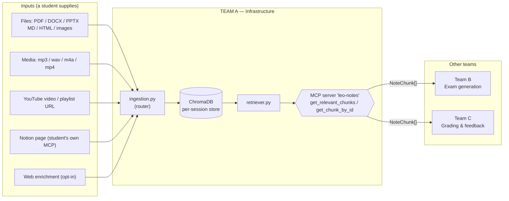
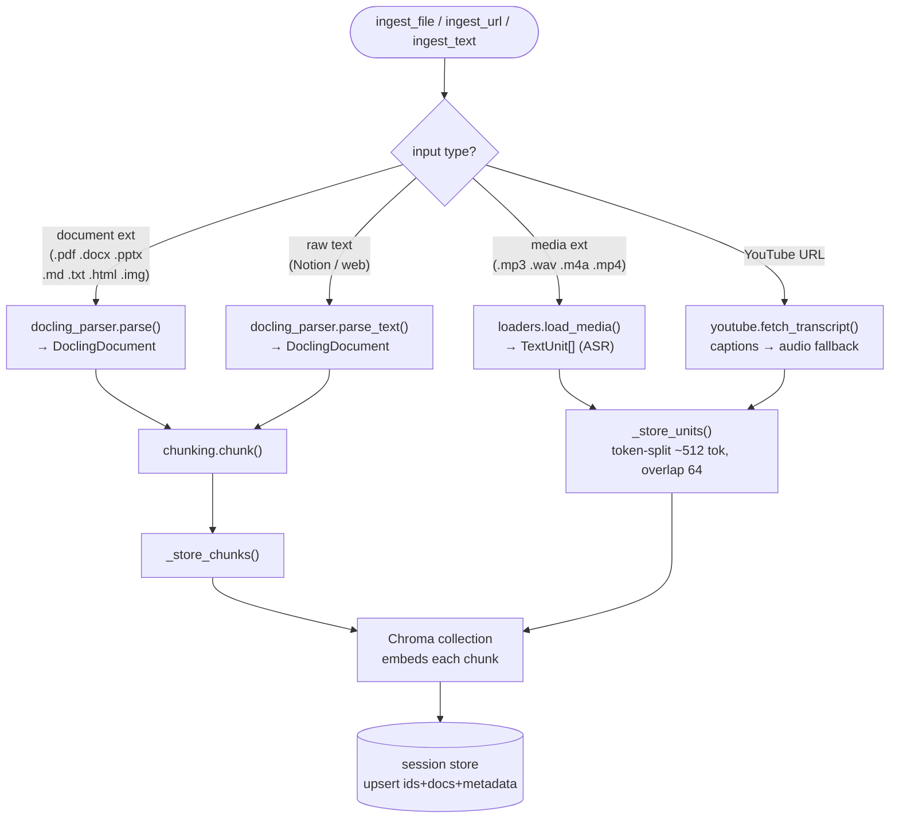
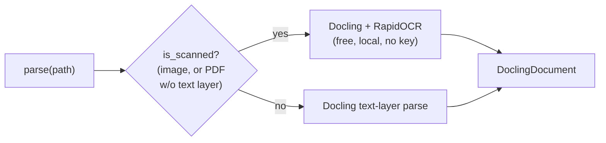
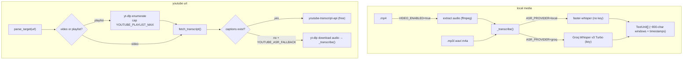
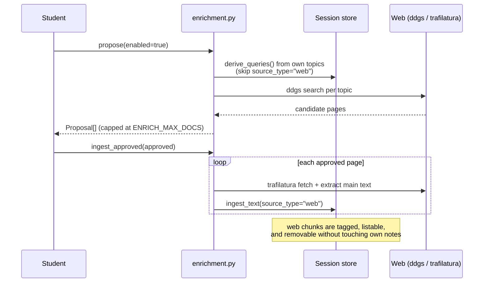
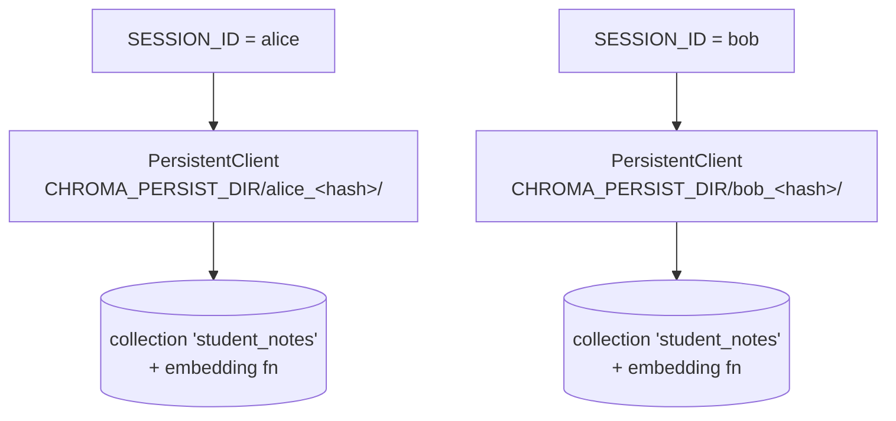
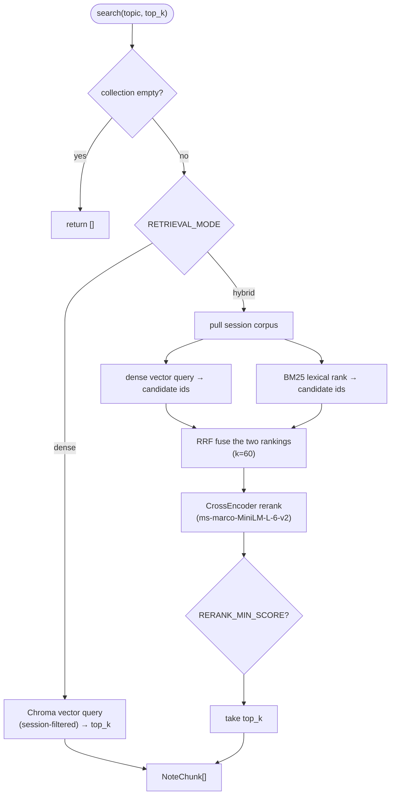
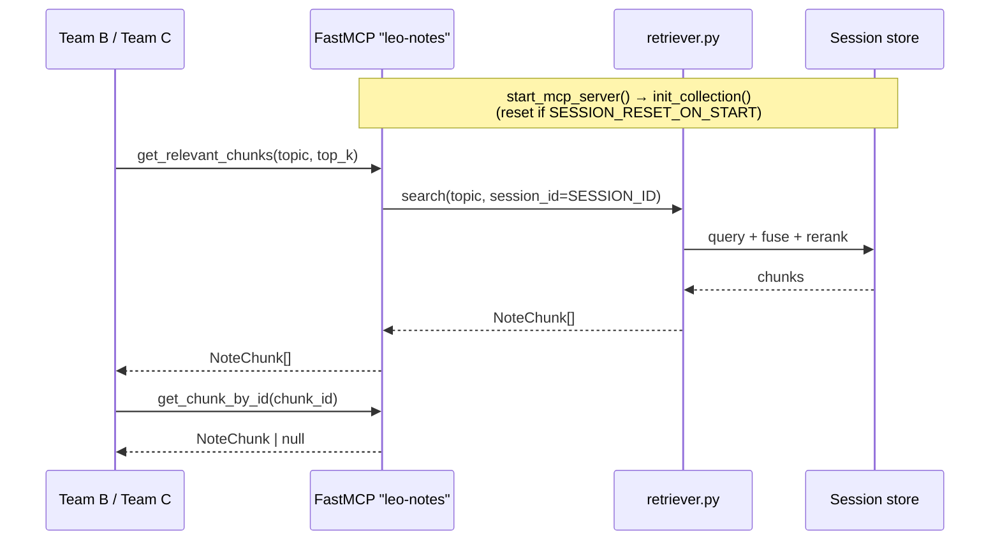

# Team A — Notes Ingestion & Retrieval (Infrastructure)

This is **Team A's** part of the Classroom Exam Agent. We own the layer that turns a student's raw
material — PDFs, slides, docs, images, audio/video, YouTube, Notion pages, and optional web
enrichment — into a searchable local vector store, and expose it to the rest of the system through
**one MCP gateway**. Teams B (exam creation) and C (grading) never touch the database directly; they
call our MCP tool.

> Frozen contracts and design notes live in `specs/001`…`specs/006` and `.specify/memory/constitution.md`.
> The MCP server is the **only** gateway to the vector DB.

---

## What Team A owns

```
mcp_server/                      # the gateway Teams B & C call
├── server.py                    # FastMCP app "leo-notes" + start_mcp_server()
└── tools/retrieval_tool.py      # get_relevant_chunks(topic), get_chunk_by_id(chunk_id)

vector_db/                       # ingest + store + retrieve
├── docling_parser.py            # PDF/DOCX/PPTX/MD/HTML/images → DoclingDocument (OCR for scans)
├── chunking.py                  # HybridChunker (default) or semantic chunking → Chunk[]
├── loaders.py                   # audio/video → transcript TextUnit[] (faster-whisper / Groq)
├── youtube.py                   # captions (free) + playlist enumerate + audio fallback
├── notion.py                    # Notion page payload → markdown text (no Notion SDK here)
├── enrichment.py                # opt-in web search → approve → ingest (source_type="web")
├── ingestion.py                 # router: file/url/text → parse/transcribe → chunk → store
├── embedder.py                  # embedding function (OpenAI / local / auto)
├── chroma_client.py             # per-session ChromaDB client + collection + reset
└── retriever.py                 # hybrid (dense+BM25+RRF+rerank) / dense search

schemas/note_chunk.py            # NoteChunk — the only object that crosses to Teams B & C
config/settings.py              # all .env config
tests/team_a/                    # pytest suite for everything above
```

---

## Where we sit in the system



**The contract** is `NoteChunk` — that's all Teams B and C ever see:

```python
class NoteChunk(BaseModel):     # schemas/note_chunk.py
    chunk_id: str
    topic: str
    content: str
    session_id: str
```

Page numbers, slide numbers, headings, and timestamps are kept as **internal Chroma metadata** only;
they never leak into the contract.

---

## Ingestion: how any input becomes chunks

`ingestion.py` is a router. It looks at *what kind of thing* you handed it and sends it down one of
four paths, but every path ends the same way — chunks written to the session's Chroma collection.



**Why two store paths?** Documents carry real structure (headings, pages, slides), so Docling's
chunker does the splitting and we keep that provenance. Transcripts are a flat stream of timestamped
text, so they're token-split with overlap and keep a `timestamp` instead of a page number.

Every chunk gets a deterministic id and a metadata bag:

```
id     = "{session_id}:{source_file}:{locator}:{index}"
meta   = { topic, session_id, source_file, transcribed, source_type,
           page|slide?, headings?, timestamp?, source_ref?, notion_page? }
```

### Document parsing & OCR (`docling_parser.py`)

Documents go through [Docling](https://docling-project.github.io/docling/), which produces a
structure-aware `DoclingDocument`. Scanned PDFs and images are OCR'd **locally and for free** —
`is_scanned()` checks whether a PDF actually has a text layer (via PyMuPDF) before deciding to OCR.



`DOCLING_OCR_ENGINE` picks `rapidocr` (default), `easyocr`, or `tesseract`. Handwriting is
best-effort — a hosted vision-LLM OCR is the noted future upgrade.

### Chunking (`chunking.py`)

```mermaid
flowchart TD
    C["chunk(dl_doc)"] --> MODE{"CHUNK_MODE"}

    MODE -->|"hybrid (default)"| H["HybridChunker<br/>tokenizer = tiktoken for EMBEDDING_MODEL<br/>max_tokens = CHUNK_MAX_TOKENS, merge_peers"]
    H --> CTX["contextualize(chunk)<br/>prepend heading breadcrumbs"]

    MODE -->|"semantic (opt-in)"| S["HierarchicalChunker → embed each unit<br/>group adjacent units while<br/>cosine ≥ SEMANTIC_SIM_THRESHOLD<br/>and tokens ≤ CHUNK_MAX_TOKENS"]

    CTX --> OUT["Chunk[] (content + page + headings)"]
    S --> OUT
```



The crucial detail: the **stored text is the `contextualize()` output** — the chunk with its
heading/section breadcrumbs prepended. So the text we embed and the text we store are identical and
both carry structural context. (Semantic mode reuses the OpenAI embedder at ingest time, so it costs
API calls; hybrid is the free default.)

### Media & YouTube (`loaders.py`, `youtube.py`)



Transcribed sources (scanned docs, recordings, auto-captions, the audio fallback) are flagged
`transcribed=true` — downstream knows that text is approximate.

### Notion & web enrichment

**Notion** (`notion.py`) never holds an API key. The student's *own* Notion MCP fetches the page; we
just normalize the returned block payload into markdown and hand it to `ingest_text`.

**Web enrichment** (`enrichment.py`) is **opt-in and off by default** (`ENRICH_ENABLED=false`). With
it off, nothing here touches the network. When on, it's a human-in-the-loop flow:



`list_enrichment()` and `remove_enrichment()` let the student see and wipe enriched material
separately — it never contaminates their own notes.

---

## Storage: session isolation (`chroma_client.py`)

Isolation is **physical, not a filter**. Each `SESSION_ID` maps to its own on-disk directory and its
own `PersistentClient`, so two sessions (e.g. two terminals) can never see or overwrite each other.



The embedding function is attached to the **collection**, so indexing and querying always use the
same model — they cannot drift apart. `EMBEDDING_PROVIDER=auto` tries OpenAI and falls back to a
local sentence-transformers model if the key is missing or fails a healthcheck.

`SESSION_RESET_ON_START=true` clears only the bound session's store on startup.

---

## Retrieval: how a topic becomes ranked chunks (`retriever.py`)

The default `RETRIEVAL_MODE=hybrid` is a four-stage funnel. `dense` mode skips straight to the vector
query.



- **Dense** catches meaning ("photosynthesis" ≈ "how plants make food").
- **BM25** catches exact terms the embedder might smear (codes, names, formulae).
- **RRF** fuses both rankings without needing comparable scores.
- **Rerank** is the precision pass — a cross-encoder reads `(query, chunk)` pairs directly.

`search_debug()` returns the ids at every stage (`dense`, `bm25`, `fused`, `reranked`, `final`) — use
it when a result looks wrong. `RERANK_ENABLED`, `RERANK_MIN_SCORE`, and `RETRIEVAL_CANDIDATE_K` tune
the funnel.

---

## The MCP gateway (`mcp_server/`)



Two tools, that's the whole public surface:

| Tool | Returns |
|------|---------|
| `get_relevant_chunks(topic, top_k=5)` | ranked `NoteChunk[]` for a topic |
| `get_chunk_by_id(chunk_id)` | one `NoteChunk` (or `None`) — for citing a source chunk |

---

## Module responsibilities

| File | Responsibility |
|------|----------------|
| `schemas/note_chunk.py` | `NoteChunk` model — the cross-team contract |
| `config/settings.py` | loads `.env`, exposes config constants |
| `vector_db/embedder.py` | builds the embedding function (OpenAI / local / auto) |
| `vector_db/chroma_client.py` | per-session client + collection, `reset_collection()` |
| `vector_db/docling_parser.py` | parse documents → `DoclingDocument`; RapidOCR for scans/images |
| `vector_db/chunking.py` | `chunk()` — HybridChunker (default) or semantic |
| `vector_db/loaders.py` | audio/video transcription (faster-whisper / Groq) |
| `vector_db/youtube.py` | `parse_target` / `fetch_transcript` / `list_playlist` / `audio_fallback` |
| `vector_db/notion.py` | `normalize_page()` — Notion payload → markdown text |
| `vector_db/enrichment.py` | opt-in web `propose` / `ingest_approved` / `list` / `remove` |
| `vector_db/ingestion.py` | `ingest_file` / `ingest_url` / `ingest_text` router |
| `vector_db/retriever.py` | `search` / `search_debug` / `get_by_id` |
| `mcp_server/tools/retrieval_tool.py` | the two MCP tools |
| `mcp_server/server.py` | FastMCP app + `start_mcp_server()` |

---

## Run it

```bash
python -m venv venv && venv\Scripts\activate     # Windows
pip install -r requirements.txt
cp .env.example .env                              # fill in keys (all optional — free local defaults)

pytest tests/team_a                               # run our test suite
python -m mcp_server.server                       # start the MCP gateway
streamlit run sandbox/app.py                      # optional ingest/search playground
```

---

## Configuration (`.env`)

| Group | Key | Default | Notes |
|-------|-----|---------|-------|
| Embeddings | `EMBEDDING_PROVIDER` | `auto` | `openai` / `local` / `auto` (auto falls back to local) |
| | `EMBEDDING_MODEL` | `text-embedding-3-small` | OpenAI model |
| | `LOCAL_EMBEDDING_MODEL` | `BAAI/bge-small-en-v1.5` | sentence-transformers fallback |
| Storage | `CHROMA_PERSIST_DIR` | `./chroma_db` | per-session subdirs created underneath |
| | `CHROMA_COLLECTION_NAME` | `student_notes` | |
| Chunking | `CHUNK_MODE` | `hybrid` | `hybrid` (structure) / `semantic` (similarity, opt-in) |
| | `CHUNK_MAX_TOKENS` | `512` | per-chunk token budget |
| | `MIN_CHUNK_CHARS` | `0` | drop tiny chunks |
| OCR | `DOCLING_DO_OCR` | `true` | toggle document OCR |
| | `DOCLING_OCR_ENGINE` | `rapidocr` | `rapidocr` / `easyocr` / `tesseract` |
| | `DOCLING_BITMAP_AREA_THRESHOLD` | `0.05` | how aggressively embedded figures are OCR'd |
| ASR | `ASR_PROVIDER` | `local` | `local` (faster-whisper, no key) / `groq` |
| | `VIDEO_ENABLED` | `false` | enable `.mp4` ingestion |
| YouTube | `YOUTUBE_ASR_FALLBACK` | `true` | transcribe when no captions exist |
| | `YOUTUBE_PLAYLIST_MAX` | `50` | playlist enumeration cap |
| Retrieval | `RETRIEVAL_MODE` | `hybrid` | `hybrid` / `dense` |
| | `RETRIEVAL_TOP_K` | `5` | results returned |
| | `RETRIEVAL_CANDIDATE_K` | `20` | candidate pool before rerank |
| | `RERANK_ENABLED` | `true` | cross-encoder rerank |
| | `RERANK_MIN_SCORE` | _(off)_ | drop weak results |
| Enrichment | `ENRICH_ENABLED` | `false` | opt-in web enrichment |
| | `ENRICH_MAX_DOCS` | `10` | cap on enriched pages |
| Session | `SESSION_ID` | `default` | binds the process to one session |
| | `SESSION_RESET_ON_START` | `true` | clear this session's store on start |

---

## For Teams B and C

Call `get_relevant_chunks(topic)` and use the returned `NoteChunk[]`. **Do not read ChromaDB
directly** — the MCP server is the only gateway (frozen contract). Mock against
`specs/001-notes-ingestion-retrieval/contracts/`.
