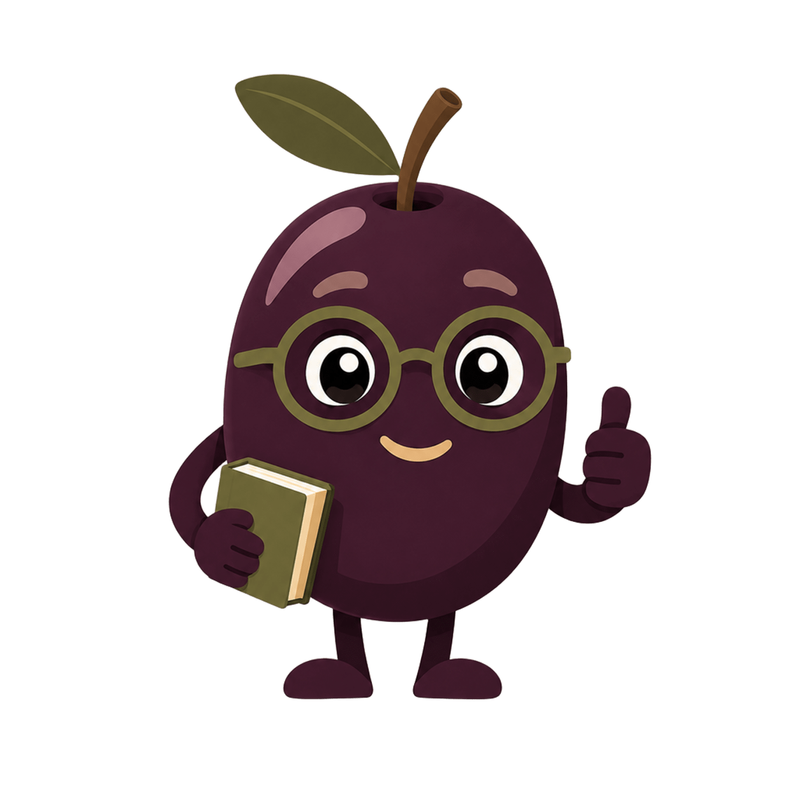
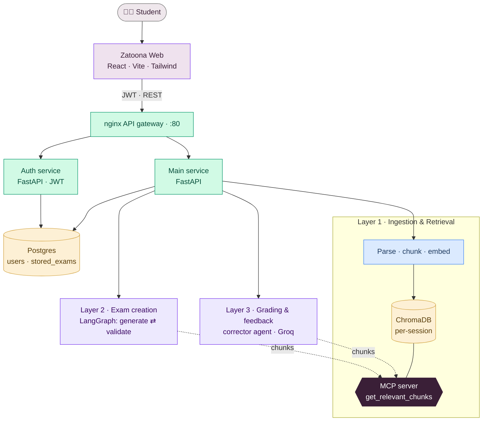
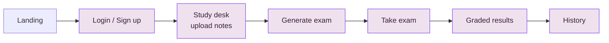
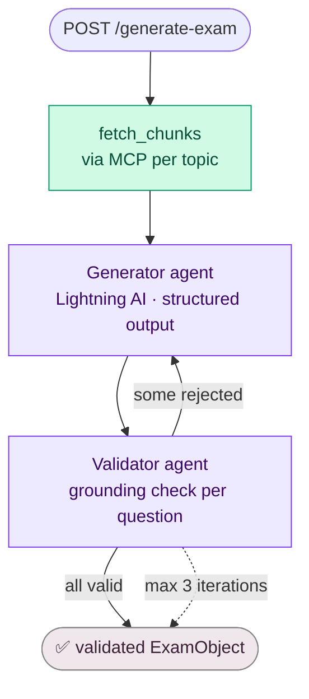
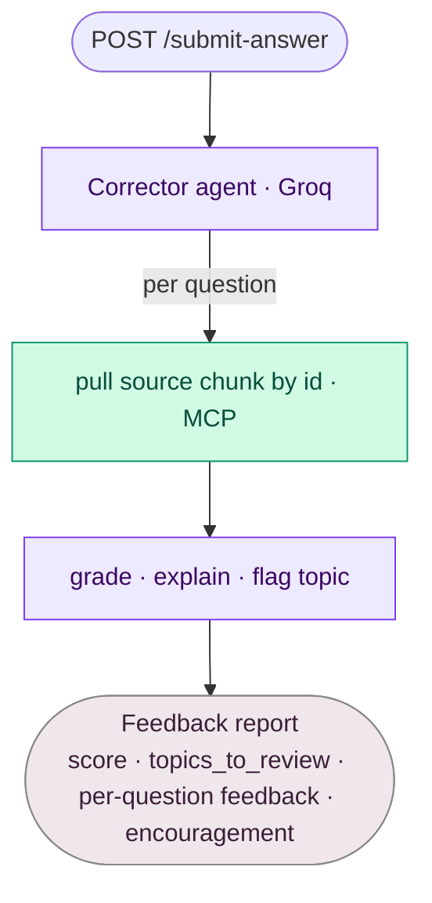
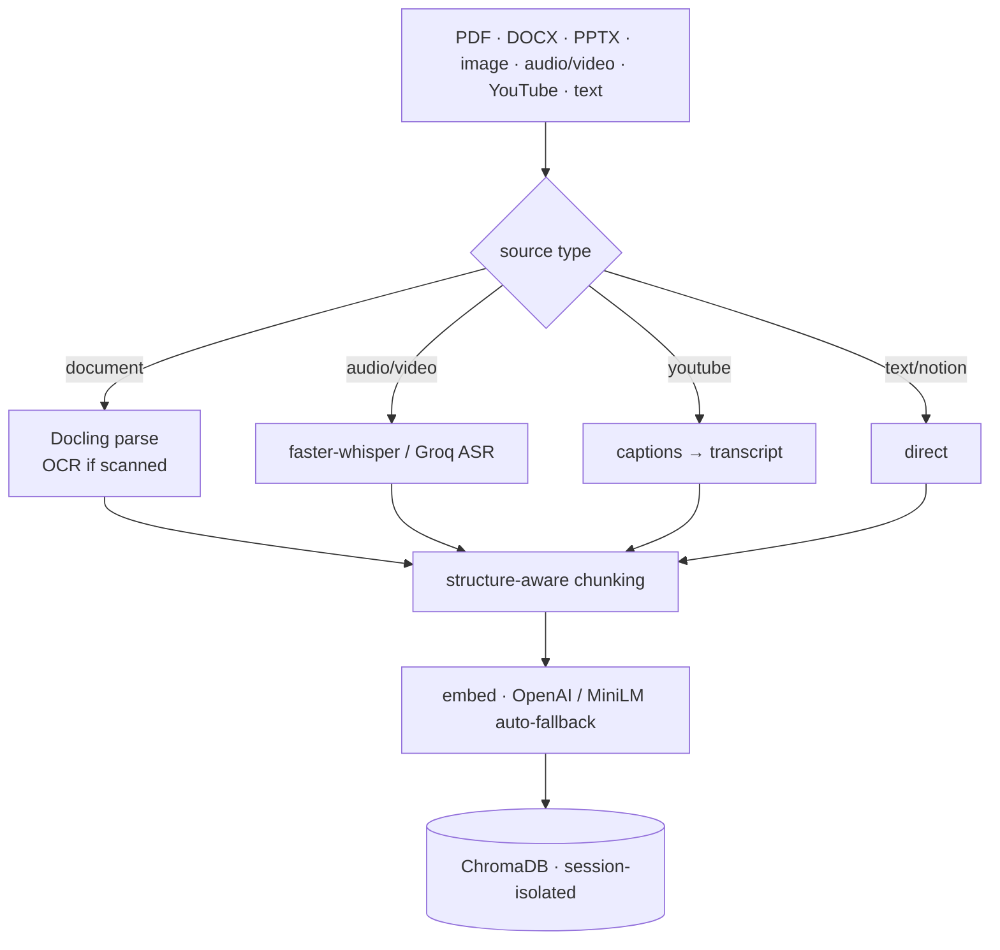

<div align="center">



# Zatoona 🫒

**Agentic, notes-grounded exam generator & grader** — study smart, ace it with less.

*Turn your own study material into a fair, validated exam, take it, and get honest, encouraging feedback — every question grounded strictly in your notes.*


[Overview](#-overview) · [Architecture](#-system-architecture) · [How it works](#-how-it-works) · [Quick start](#-quick-start) · [API](#-api-reference) · [Tech stack](#-technology-stack)

</div>

---

> [!NOTE]
> **Zatoona** is Arabic for *olive* — the briefest, smartest summary of a subject. The kind of revision that earns an A+ from a fraction of the effort. This project is that idea as software: study *smart*, not *hard*.

---

## 🎯 Overview

Zatoona is an end-to-end multi-agent system that transforms a student's raw study material into a personalized, validated exam — then grades the student's answers and returns structured, encouraging feedback.

A student uploads notes in almost any format. The material is parsed, chunked, embedded, and stored in a per-session vector database. A self-correcting LangGraph pipeline generates exam questions grounded **strictly** in those notes and validates each one. The student answers through a polished web UI, and a corrector agent grades each answer against the original source chunk — explaining mistakes and flagging topics to review.

The system is two cooperating codebases:

| Component | Stack | Role |
|-----------|-------|------|
| **`Leo-Agent/`** — backend | Python · FastAPI · LangChain/LangGraph · MCP · ChromaDB · Postgres | Ingestion, retrieval, exam generation, grading, auth, REST API behind an nginx gateway |
| **`zatoona-web/`** — frontend | React · Vite · TypeScript · Tailwind v4 · motion | The student-facing web app (landing, auth, upload, exam, results, history) |

---

## 🏗 System Architecture

Everything reaches the backend through a single **nginx gateway** on port 80. Auth is JWT; the main service orchestrates three layers, all of which read note chunks through one **MCP server** — no layer touches ChromaDB directly.



### Frontend journey



---

## 🔬 How it works

<details open>
<summary><b>Layer 2 — Exam creation (self-correcting LangGraph loop)</b></summary>

<br/>

A LangGraph state machine fetches the relevant chunks, drafts questions, and validates each one against its source chunk. Rejected questions are regenerated with feedback (approved ones are kept by a programmatic merge), looping up to 3 times until every question is grounded.



</details>

<details>
<summary><b>Layer 3 — Grading & feedback</b></summary>

<br/>

The corrector agent grades each answer by re-fetching the question's source chunk, explains mistakes from the notes, and produces an encouraging report.



</details>

<details>
<summary><b>Layer 1 — Ingestion & hybrid retrieval</b></summary>

<br/>

Almost any source becomes a searchable, **session-isolated** vector store. Each `session_id` maps to its own ChromaDB collection, so users never see each other's material.



Retrieval is hybrid: dense vectors catch meaning, BM25 catches exact terms, RRF fuses them, and a cross-encoder reranks for precision.

```mermaid
flowchart LR
    Q[topic query] --> DENSE[dense vector search]
    Q --> BM[BM25 keyword search]
    DENSE --> RRF[RRF fusion]
    BM --> RRF
    RRF --> RR[cross-encoder rerank]
    RR --> TOPK[top-K NoteChunk\[\]]
```

</details>

---

## 🚀 Quick start

You need **Docker** (backend) and **Node 20+** (frontend).

### 1 · Backend

```bash
cd Leo-Agent
# create the three env files (see Configuration below), then:
docker compose up --build
curl http://localhost/health     # {"status":"UP", ...}
```

The gateway comes up on **http://localhost** (port 80). First run downloads embedding/reranker/OCR models, so give it a few minutes.

### 2 · Frontend

```bash
cd zatoona-web
npm install
npm run dev                      # http://localhost:5173
```

In dev, Vite proxies all API paths to the gateway server-side (no CORS, no preflight). Open **http://localhost:5173** and sign up.

<div align="center">
<br/>
<!-- Drop a screen recording at assets/demo.gif and it renders here -->

<br/><sub>📽️ add <code>assets/demo.gif</code> to show the flow: upload → generate → take → graded results</sub>
</div>

---

## 💻 Frontend (`zatoona-web`)

A polished SPA built around the brand's aubergine olive mascot.

- **Public landing** at `/`, app behind login at `/app` (study desk · exam · results · history).
- **Dark mode** (class-based, no-flash, remembered), **staged loaders** that show named phases during the multi-minute uploads/generation so the wait never looks frozen, and a mascot that reacts to each state.
- **Per-user isolation** of all study state (topics/exam/report are namespaced per account; nothing leaks across users on a shared browser).

See [`zatoona-web/README.md`](zatoona-web/README.md) for component structure and build details.

---

## 🛠 Technology Stack

| Layer | Technology |
|-------|-----------|
| Agent framework |  |
| Orchestration |  |
| Agent gateway |  |
| API server |   |
| Vector store |  |
| Relational DB |  |
| Embeddings |   |
| Exam-gen LLM |  |
| Grading LLM |  |
| Doc parsing |  |
| Transcription |  |
| Validation |  |
| Frontend |     |
| Containerization |  |
| Tracing |  |

---

## 🔌 API Reference

Base URL **`http://localhost`**. Auth header: `Authorization: Bearer <access_token>`.

| Step | Method | Path | Auth | Body |
|------|--------|------|------|------|
| Sign up | `POST` | `/auth/signup` | — | form: `username`, `email`, `password` |
| Login | `POST` | `/auth/login` | — | form: `username`, `password` |
| Refresh | `POST` | `/auth/refresh` | — | JSON: `refresh_token` |
| Logout | `POST` | `/auth/logout` | ✅ | form: `refresh_token` (optional) |
| Health | `GET` | `/health` | — | — |
| Upload notes | `POST` | `/upload/` | ✅ | multipart: `topic` + one of `file` / `url` / `text` |
| Generate exam | `POST` | `/generate-exam/` | ✅ | JSON: `topics`, `num_questions`, `difficult` |
| Submit answers | `POST` | `/submit-answer/` | ✅ | JSON: `answers[]` |
| Exam history | `GET` | `/history/` | ✅ | — |
| Get exam | `GET` | `/get-exam/{exam_id}` | ✅ | — |

Full request/response shapes and Streamlit/JS examples live in [`api-doc.md`](api-doc.md).

### Core schemas

```python
class Question(BaseModel):
    question_id: str
    topic: str
    question: str
    correct_answer: str      # never exposed to the student
    source_chunk_id: str     # traceability to the note chunk

class ExamObject(BaseModel):
    session_id: str
    topics: list[str]
    status: Literal["draft", "validated"]
    questions: list[Question]

class FeedbackReport(BaseModel):
    session_id: str
    score: int
    topics_to_review: list[str]
    encouragement: str
    results: list[QuestionResult]   # per-question: is_correct, explanation, source_chunk
```

---

## ⚙️ Configuration

Three env files are read before the first `docker compose up`:

| File | Contains |
|------|----------|
| `Database/.env` | Postgres user / password / db |
| `Authentication/.env` | `SECRET_KEY`, token lifetimes |
| `.env` | `GROQ_API_KEY`, `LIGHTNING_API_KEY`, `OPENAI_API_KEY`, optional `LANGSMITH_*` for tracing |

Key knobs (see `config/settings.py` for the full list):

| Key | Default | Description |
|-----|---------|-------------|
| `EMBEDDING_PROVIDER` | `auto` | `openai` / `local` / `auto` |
| `RETRIEVAL_MODE` | `hybrid` | `hybrid` or `dense` |
| `RERANK_ENABLED` | `true` | cross-encoder reranking |
| `MAX_VALIDATION_ITERATIONS` | `3` | exam self-correction loops |
| `GROQ_MODEL` | `llama-3.3-70b-versatile` | grading model |
| `SESSION_RESET_ON_START` | `false` | clears the bound session's chunks on startup |

**Observability.** With `LANGSMITH_*` set, all generator/validator/corrector LLM calls are traced to LangSmith automatically.

---

## 📁 Project Structure

```
.
├── Leo-Agent/                  # backend (FastAPI · LangGraph · MCP · ChromaDB)
│   ├── app.py                  # main service: upload, generate-exam, submit-answer, history
│   ├── agents/                 # generator · validator · corrector
│   ├── graph/                  # LangGraph state machine (nodes · edges · state)
│   ├── mcp_server/             # MCP gateway + retrieval tools
│   ├── vector_db/              # ingestion · chunking · embeddings · hybrid retriever
│   ├── Authentication/         # JWT auth · SQLAlchemy models
│   ├── nginx/                  # API gateway config
│   └── docker-compose.yml
├── zatoona-web/                # frontend (React · Vite · Tailwind)
├── api-doc.md                  # REST contract + examples
└── Zatoona.png                 # the mascot
```

---

## ⚠️ Limitations & 🔭 Future Work

- **Questions are open-text today.** MCQ support is on the roadmap.
- **Topic naming is manual.** An agent that auto-titles uploaded material from its content is planned.
- **Web enrichment** exists in `vector_db/enrichment.py` but is not yet wired end-to-end.
- Exam generation is synchronous (no live progress stream); the frontend simulates staged progress.
- Retrieval quality is bounded by the quality of the uploaded material.

---

## 👥 Team


| Mazen Mohamed | Mahmoud Elgendy | Mohamed Emad | Mohamed Magdy | Mohamed Refai | Ziad Mahmoud |
|:---:|:---:|:---:|:---:|:---:|:---:|
| [](https://github.com/Mazen149) | [](https://github.com/rklorD456) | [](https://github.com/3omdawy11) | [](https://github.com/mohamedmagdy9977) | [](https://github.com/mohammedrefai20) | [](https://github.com/ZeyadMahmoudAmrMohamed) |

<div align="center">
<br/>
<sub>🫒 Zatoona · study smart, ace it with less.</sub>
</div>
